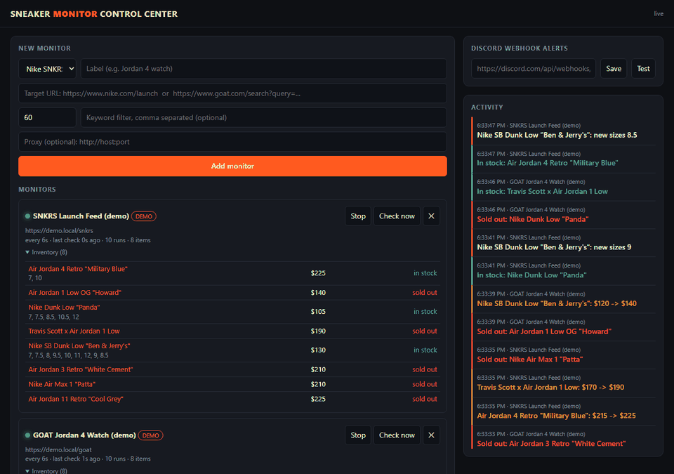

# Sneaker Monitor Control Center

A real-time release and restock monitor for **Nike SNKRS** and **GOAT**. Headless-browser watchers scrape the sites on a schedule, a diff engine detects what changed, and a live dashboard plus Discord alerts tell you the moment it happens.



> **Monitoring only.** This tool watches inventory and alerts you. It does not check out, log in, or attempt to evade bot protection. Buying stays manual.

## Features

- **Headless scraping** with Playwright Chromium (images, media and fonts blocked to keep checks light)
- **Site adapters** for SNKRS (launch feed) and GOAT (search results and product pages), each returning one normalized product shape
- **Change detection**: new releases, restocks, sell-outs, price moves and newly available sizes
- **Live dashboard** over Server-Sent Events: start and stop monitors, trigger a check now, browse per-monitor inventory, follow an activity feed
- **Discord webhook alerts** with a one-click test button
- **Per-monitor config**: interval (with jitter), keyword filter, optional proxy
- **Demo mode** with a simulated drop feed, so it runs anywhere with no network and no dependence on live sites
- State persists to disk and running monitors resume on restart

## Quick start

```bash
git clone <this-repo>
cd sneaker-monitor
npm install
npm run demo      # simulated drops at http://localhost:3001
```

For live monitoring, run `npm start`, add a monitor from the dashboard (for example `https://www.nike.com/launch`), and optionally paste a Discord webhook.

### Docker

```bash
DEMO=1 docker compose up --build   # demo mode
docker compose up --build          # live mode
```

### Tests

```bash
npm test
```

The diff engine, which decides what counts as a restock, sell-out, price change or new size, is covered by unit tests.

## How it works

```
 scheduler (per monitor, jittered)
      |
      v
 Playwright headless Chromium --> site adapter (snkrs | goat | demo)
      |                                   |
      |                          normalized products
      v                                   v
                 diff engine  <---- previous snapshot
                     |
          +----------+-----------+
          v                      v
   event log + SSE stream   Discord webhook
          |
          v
     live dashboard
```

| Path | Role |
| --- | --- |
| `src/monitor.js` | `Hub`: scheduling, browser lifecycle, diff engine, persistence, notifications |
| `src/adapters.js` | Per-site scrapers plus the simulated demo feed |
| `src/server.js` | Express API and the SSE stream |
| `public/index.html` | Dashboard (no build step) |
| `test/` | Diff engine tests |

### Design decisions

- **SSE instead of WebSockets.** The data flows one way, server to browser, and SSE reconnects on its own, so there is less code.
- **Adapters return one shape.** Adding a retailer means writing one `scrape(page, config)` function; the diff engine and UI do not change.
- **JSON-LD first, DOM second.** Structured data survives site redesigns better than CSS selectors.
- **Demo adapter.** It runs through the same scheduler, diff engine and dashboard as the live adapters, which makes the project easy to try and test.
- **Localhost by default.** The server binds to `127.0.0.1` unless `HOST` is set. There is no authentication, so do not expose it publicly as-is.

## Limitations

- Selectors for live sites are best-effort. Nike and GOAT change their markup regularly, so expect to tune `src/adapters.js`.
- Both sites may rate-limit or block headless traffic. Keep intervals at 30 seconds or more and respect each site's terms of service.
- SNKRS feed cards do not expose a price, so price tracking works on product pages only.

## License

MIT
